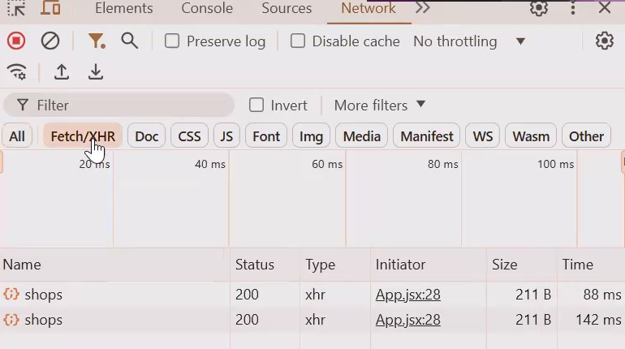

# Langkah - Langkah

- npm init
- npm create vite@latest
- remove exiting, react, javaScript
- cd, npm install, npm run dev

## Mengonfigurasi Tailwind CSS

- Instal Tailwind CSS beserta dependensinya:
  ```sh
  npm install -D tailwindcss postcss autoprefixer
  ```
- Inisialisasi Tailwind CSS:
  ```sh
  npx tailwindcss init -p
  ```
- Buka file `tailwind.config.js`, lalu ubah bagian `content` menjadi:

  ```js
  /** @type {import('tailwindcss').Config} */
  export default {
    content: ["./index.html", "./src/**/*.{js,ts,jsx,tsx}"],
    theme: {
      extend: {},
    },
    plugins: [],
  };
  ```

- Buka `src/index.css` atau `src/App.css`, lalu tambahkan kode berikut:
  ```css
  @tailwind base;
  @tailwind components;
  @tailwind utilities;
  ```

---

## Hit API dari Backend

1. useState untuk store data secara state react nya | Homepage.jsx
2. fetch data | Homepage.jsx
3. instal axios
   - npm i axios
4. function async untuk fetch data lewat API axios
5. panggil functionya

hasil fect api sukses atau tidak inspact/network/fetch/response


6. menyimpan data ke state (update)
7. tambah defind dependensi array kosong
   warning: infinite looping
   use effect harus ada parameter kedua (defind dependensis) yang menandakan jangan proses terus menerus, hanya terjadi saat komponen render pertama saja
8. panggil shop sebagai data
   key = mengambil setiap index dari datanya
   sesuaikan dengan nama tabelnya
   disini menggunakan shop karena data product belum selesai di BE (jika product sudah selesai maka langsung gunakan product)

## Eror

9. state untuk menyimpan error dan buat di try catch
   sesuatu yang null (sesuatu yang gak ada)
10. kondisional rendering untuk User Interface (UI) dan User Experience (UX)

## Loading

11. state Loading
    selalu dibuat dalam keadaan true (akan selalu loading)
12. saat fetch API simpan di Finaly
    jika ada eror akan trus loading dan saat berhasil akan selesai (mengakhirkan loading)
13. tambah loading di atas error untuk UI/UX

## Authenticate

- nyalakan authenticate di BE

```js
router.get("", authenticate, shopController.getAllShop);
```

- maka di FE akan gagal fetch API nya

untuk membuat user login dulu baru bisa get API (implement auth di route)

- buat Login.jsx (isinya const handleLogin, ambil post dari API, const token, dan form login)
- buat utils/auth.js untuk set isTokenExpired

14. buat routing homepage di app.jsx
15. implementasi useEffect dan useState
    is => boolean, default value false (sudah login atau tidak)
16. check user nya login gak
    untuk mengetahui sudah login atau tidak gunakan useEffect menggunakan token
    user harus login sebelum masuk homepage maknaya pengecekan dilakukan di halaman utama
17. !! = menjadikan false setiap string ksosong
18. gunakan auth di navbar
    jika user login maka navbar muncul
19. gunakan auth di homepage
    element memanggil homepage, tambahkan ternary operator isAunthenticated jika ada token maka arahkan ke homepage jika tidak ada maka arahkan ke login
20. gunakan auth di login
    navigasikan ke homepage (kebalikan homepage)

21. hendler NotFound

coba login menggunakan email Lou24@gmail.com dan password admin123
maka akan masuk ke home page dan jika kembali ke login maka akan ketendang ke homepahe karena user sudah login

## Logout

22. buat button onclick={onLogout} | NavbarwithStyling
23. propstnya simpan di functionya (onLogout)
24. buat function untuk henling logout | app.jsx
25. panggil handel Logout sebagai value dari props onLogout

## Action Handler (Notification)

notifications komponen dinamis jadi bisa dipakai di page mana aja

- buat Notification/Notification.jsx

26. buat function baru dengan 4 props (message, description, type, onClose)
27. buat html notifications
28. style tipe success, error, info
    success: "text-green-500",
    error: "text-red-500",
    info: "text-blue-500",
29. pakai di Login.jsx | tambah state baru notifications kodisi null jadi gak akan muncul di awal kondisi render
30. panggil notifications di return, jika ada notification baru render notifications render dan tambahkan props type message descripsi onClose
31. buat seNotification untuk mengambil error dari BE dan tambah kondisinonal jika BE nya tidak aman || "An error occured",
32. function panggil setNotification null || saat diklik akan close
33. time untuk notification, jadi tiap sudah beres per berapa lama akan hilang, set ke null lagi
34. buat notification succes
35. saat success login maka langsung navigate ke homepage
36. tambah navigate

## React Context

membersihkan komonen dari hal2 yang diluar state (handle hit API)
manajemen projrect react

## folder API

- tempat mainan API (axiosInstance.js) base practice axios untuk hendel agar tidak redundan
- berguna saat banyakhit API

37. gunakan axiosInstance di fect API | homepage.jsx
38. gunakan axiosInstance di post API | login.jsx

## Refactor State

- auth profider
- buat context/AuthContext.js

39. funtion AuthProvider dengan props children
40. tambah authContext yang diambil dari createContext
41. hendel auth di aplikasi | statenya false karena homepagenya terbatas (login dulu)
42. panggil user dan setuser | null karena jika belum login tidak ada datanya
43. handling navigasi
44. pidah handling auth ke sini (useEffect)
45. panggil function login untuk handling auth
    parameter token untuk reset ke lokalStorage
    setAuth true karena berhasil login
    setUser dekode token dengan jwtDecode
    jika sudah sukses login navigate ke homepae
46. panggil function logout untuk handling auth
    (tanpa parameter) remove token
    setAuth false
    setUser null
    navigate ke login
47. authContext dengan value isAuth, login, logout (dari state function) dan kasih schildren
48. guakan authProfider di main.jsx

### Hooks Fetch data

48. custom Hook | AuthContext.jsx
49. ganti ini menjadi hook di app.jsx

```js
const navigate = useNavigate();
const [isAuthenticated, setIsAuthenticated] = useState(false);
useEffect(() => {
  const token = localStorage.getItem("token");
  if (!token || isTokenExpired(token)) {
    localStorage.removeItem("token");
    localStorage.removeItem("username");
    navigate("/login");
  }
  setIsAuthenticated(!!token);
}, []);
const handleLogout = () => {
  localStorage.removeItem("token");
  localStorage.removeItem("username");
  setIsAuthenticated(false);
};
```

menjadi

```js
const { isAuthenticated, logout } = UseAuth();
```

noted handleLogout dianti logout (bawaan hooknya)
jika custom hooknya banyak maka dibuat di folder hook sendiri

### Hooks Login

50. pangil login dari custom auth
51. panggil login mengguakan react context

```js
await login(email, password);
```

yang awalnya dibawah ini ganti menjadi diatas ini

```js
      const response = await axiosInstance.post("/auth/login", {
        email,
        password,
      });
      console.log(response);

      if (response.data.isSuccess) {
        const token = response.data.data.token;
        const username = response.data.data.username;

        localStorage.setItem("token", token);
        localStorage.setItem("username", username);
        localStorage.setItem(
          "rahasia nita",
          "aku bangga bgt sama kalian FSW2 !"
        );
      const response = await axiosInstance.post("/auth/login", {
        email,
        password,
      });
      console.log(response);

      if (response.data.isSuccess) {
        const token = response.data.data.token;
        const username = response.data.data.username;

        localStorage.setItem("token", token);
        localStorage.setItem("username", username);
        localStorage.setItem(
          "rahasia nita",
          "aku bangga bgt sama kalian FSW2 !"
        );
```

logic hit API loginnya berada di AuthContext

### Hooks fetch Shop

- buat shopService.js di folder api
- pindah fetch dan buat filter didalamnya

```js
useEffect(() => {
  const fetchShops = async () => {
    setLoading(true);
    try {
      const response = await axiosInstance.get("/shops");
      const data = response.data;
      if (data.isSuccess) {
        setShops(data.data.shops);
      } else {
        setError("error");
      }
    } catch (error) {
      setError(error.message);
    } finally {
      setLoading(false);
    }
  };
  fetchShops();
}, []);
```

itu dipindah ke shopService dan di hompage panggil seperti ini

```js
useEffect(() => {
  handleFetchShops();
}, [pagination.currentPage, pagination.pageSize]);
```

noted buat filtering dan paginationsnya
